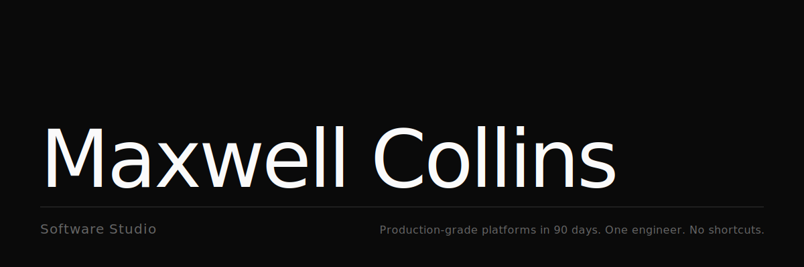
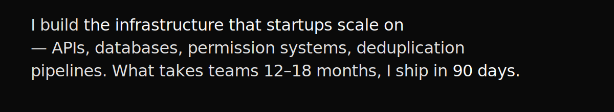
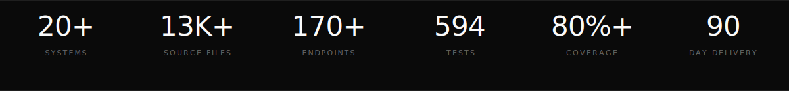
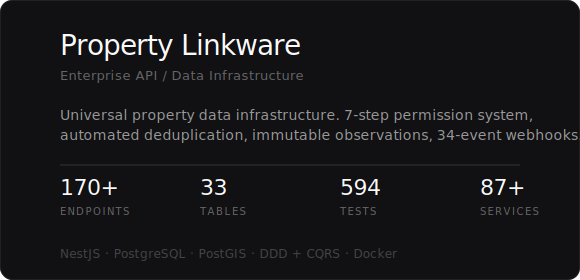
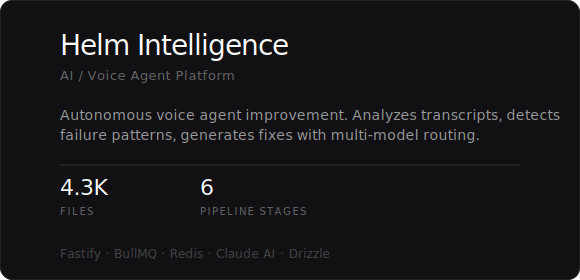
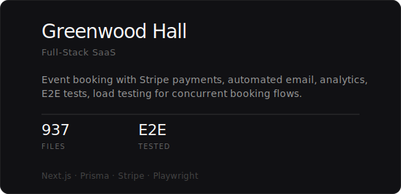
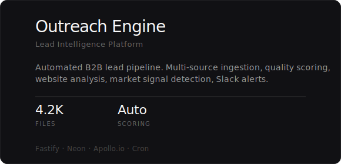
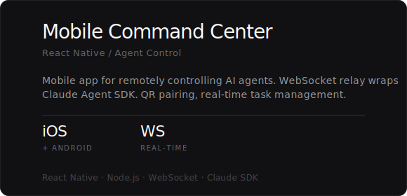
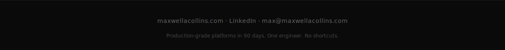

 

  

  

## Work

 

&nbsp;&nbsp;

  

&nbsp;&nbsp;

  

&nbsp;&nbsp;

 

+ 14 more repositories

 
Property Organizer · PLW Hub · MAC Invoices · Apollo MCP Server · AI Coach Engine · Guardrails Plugin · Certified Environment · Code Rescue · Life Sphere · Ops Command Center · NextPhase Website · Dashboard Starters · NestJS Clean Architecture · Property Linkware Application

 

 

**Stack** &nbsp; NestJS · Next.js · PostgreSQL · PostGIS · TypeScript · React · React Native · Fastify · Prisma · TypeORM · Drizzle · Docker · Redis · BullMQ · AWS S3 · Claude API · Stripe

 

**Patterns** &nbsp; DDD · CQRS · Clean Architecture · Event-Driven · Repository · Saga · TDD · Contract Testing

  

&nbsp;&nbsp;&nbsp;&nbsp;

  

